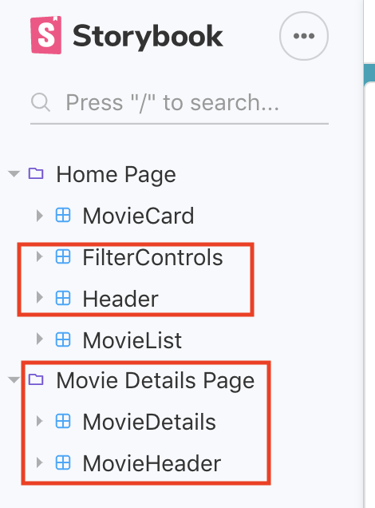
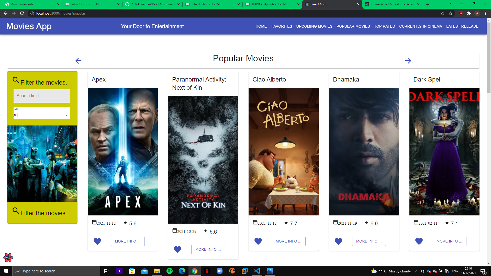
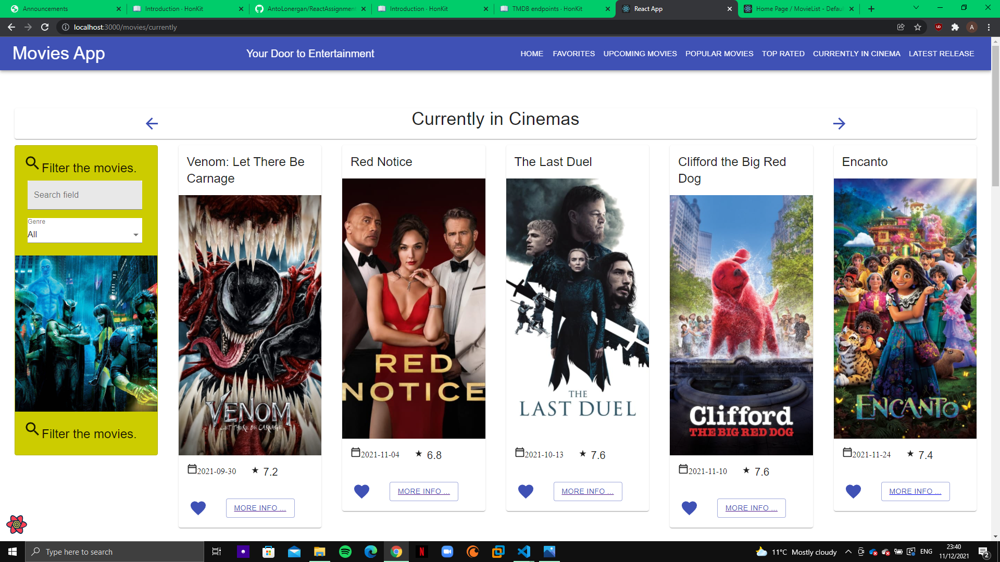
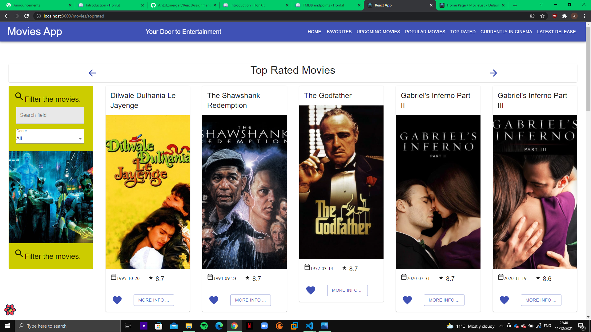
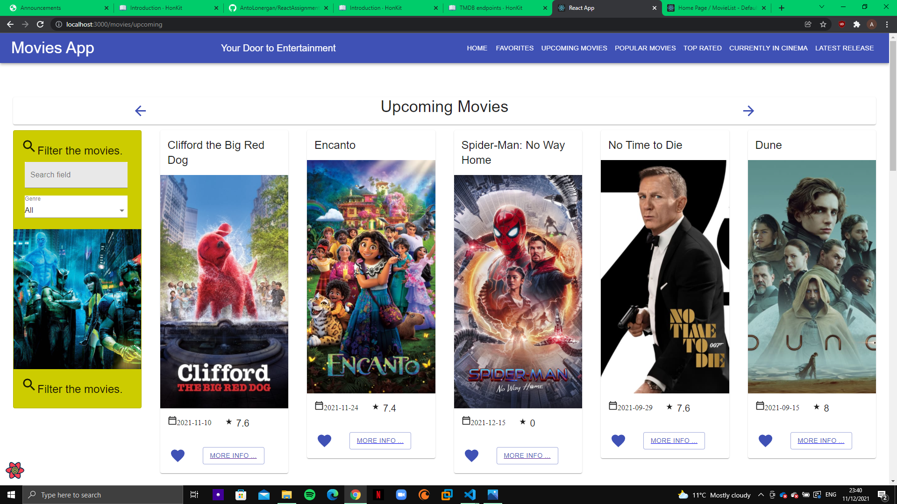
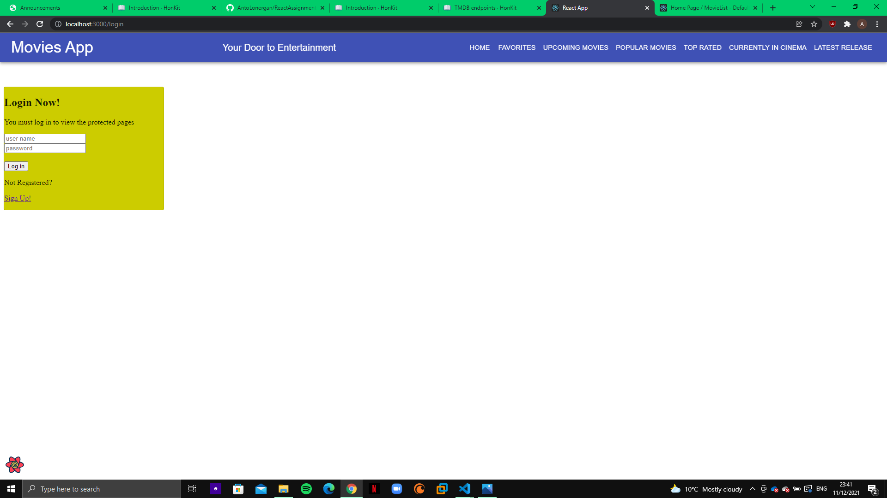
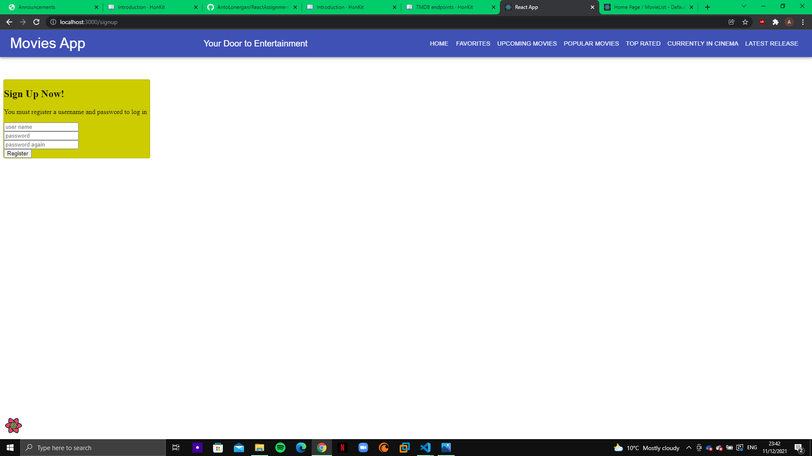
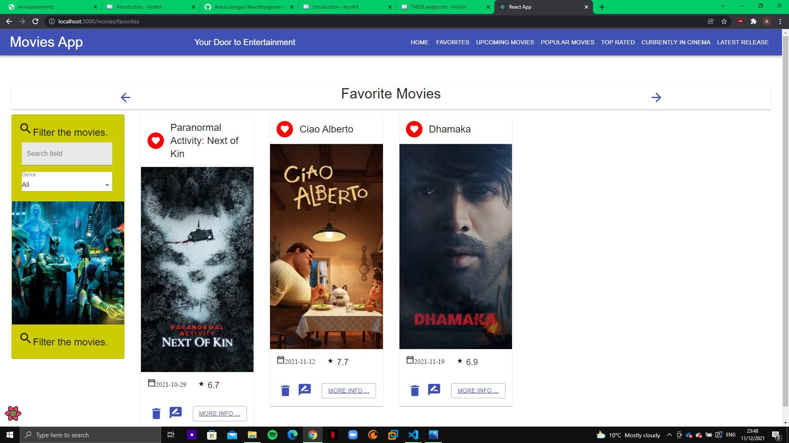
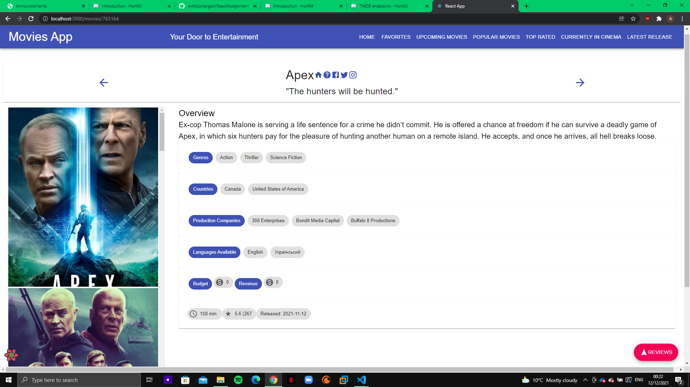

# Assignment 1 - ReactJS app.

Name: Anthony Lonergan 20089310

## Overview.

This is my assignment for React for Web App development 2.
I can get and show popular movies, upcoming movies, movies currently in cinema, random movies, and the top rated movies. I can also show the details of each movie. I can also show the latest movie and its details that was last added to the TMDB. I can add a movie to favourites and i can log in to see what I have favoured. If I do not have an account I can also sign up for one and log in then. I can search for movies in the list or I can sort by genre. I can see reviews on all movies and I can write my own review of the ones I favourite.

### Features.
[ A bullet-point list of the __new features__ you added to the Movies Fan app (and any modifications to existing features) .]
 
+ Added an Upcoming Movies Page which shows movies coming out soon.
+ Added a Popular Movies Page which shows Movies that are currently popular or trendy.
+ Added a Top-Rated Movies Page which shows the highest rated movies ever.
+ Added a Currently in Cinema Page which shows all the movies currently in Cinema.
+ Added a latest release page which shows the movies details of the last movie added to the database.
+ Added a login page for use with authentication to access private routes and login to it.
+ Added a sign up page which creates an account for you to login with.
+ Made the favourites page a private route meaning you have to login to see it. 
+ Changed the design of the filtercard and changed the picture associated
+ Changed the movie details to also show production companies, languages movie is available in and the budget the film had.
+ Changed the design of the site header.
+ Changed the design of the moviecard slightly
+ Changed the design of the movieheader to show new icons a questionmark to display the movie information in a different online database. I also added a facebook twitter and instagram icon but unfortunately I could not get the get external ids to work so those 3 are not functioning properly.
+ Added in an api for use with authentication
+ Fixed Storybook to work.
+ Changed some of the parameters for the api calls.
+ Fixed a visual glitch from my labs that showed favourite button twice.

## Setup requirements.

Open an intergrated terminal of the movies-api and run npm start to start it up for use with authentication.

## API endpoints.

[ List the __additional__ TMDB endpoints used, giving the description and pathname for each one.] 

e.g.
+ Upcoming list of movies - /movies/upcoming
+ Popular movies - /movies/popular
+ Movies Currently - /movies/currently
+ Top Rated Movies - /movies/toprated
+ Latest Movie added to database - /movies/latest

## App Design.

### Component catalogue.

[ Insert a screenshot from the Storybook UI that lists all the stories for the app's components, and highlight those relating to your __new/modified components__ - see the example screenshot below.] .......

The circled storybooks components have been modifed in some way.

### UI Design.

[ Insert screenshots of the __new/modified app pages__ you developed (and modified existing pages), Include an appropriate caption for each one (see example below).

>Homepage for the app shows random movies and show the edited site header and filtercard.

>Shows popular movies.

>Shows movies currently in cinema.

>Shows Top rated movies.

>Shows movies coming out soon.

>Shows page used to log in.

>Shows page used to sign up.

>Shows favorite page after successfully logging in.

>Shows movie details. By pressing the question mark it brings you to the corresponding movie in another movie database. The socials are not working properly unfortunately. I added extra information into the details as shown.

### Routing.

[ List the __new routes__ supported by your app and state the associated page.]

Public
+ Upcoming list of movies - /movies/upcoming
+ Popular movies - /movies/popular
+ Movies Currently - /movies/currently
+ Top Rated Movies - /movies/toprated
+ Latest Movie added to database - /movies/latest
+ Sign Up Page for authentication - /signup
+ Log In Page for authentication - /login

Private
+ !!!Changed Favourites to private route - /movies/favorites

[If relevant, state what aspects of your app are protected (i.e. require authentication) and what is public.]